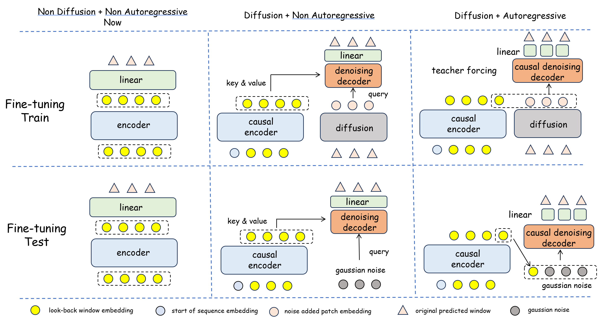

## 1

GPU Memory and Training Time / per epoch which is recorded in the Traffic dataset with a look-back window=336 and a predicted window=336

| Methods              | Params                                 | Training Time/per epoch                |
| -------------------- | -------------------------------------- | -------------------------------------- |
| TimeDART             | 2.36M(pre-training)/2.16M(fine-tuning) | 510s(pre-training)/349s(fine-tuning)   |
| SimMTM               | 14.5M(pre-training)/2.16M(fine-tuning) | 85mins(pre-training)/349s(fine-tuning) |
| TimeMAE              | 1.13M(pre-training)/2.16M(fine-tuning) | 91mins(pre-training)/349s(fine-tuning) |
| Cost                 | 2.66M(pre-training)/2.16M(fine-tuning) | 24mins(pre-training)/349s(fine-tuning) |
| PatchTST(supervised) | 64.32M                                 | 158mins                                |

## 2

Full Results of different look-back window in [96,192,336,576,720] for ETTh2 dataset and [96,192,336] for PEMS04 dataset.

| Models | look-back | predicted | TimeDART || Random Init      ||
|--------|-----------|-----------|----------------|------------------| -- | --|
| Metrics |           |           | MSE            | MAE              | MSE            | MAE              |
| ETTh2  | 96        | 96        | 0.292          | 0.344            | 0.296          | 0.353            |
|        |           | 192       | 0.374          | 0.391            | 0.382          | 0.394            |
|        |           | 336       | 0.405          | 0.416            | 0.422          | 0.430            |
|        |           | 720       | 0.421          | 0.439            | 0.436          | 0.449            |
|        |           | Avg       | 0.373          | 0.398            | 0.384          | 0.407            |
|        | 192       | 96        | 0.289          | 0.342            | 0.292          | 0.351            |
|        |           | 192       | 0.356          | 0.384            | 0.367          | 0.392            |
|        |           | 336       | 0.399          | 0.405            | 0.412          | 0.420            |
|        |           | 720       | 0.411          | 0.431            | 0.425          | 0.441            |
|        |           | Avg       | 0.364          | 0.391            | 0.374          | 0.401            |
|        | 336       | 96        | 0.283          | 0.340            | 0.294          | 0.348            |
|        |           | 192       | 0.345          | 0.382            | 0.357          | 0.390            |
|        |           | 336       | 0.365          | 0.399            | 0.375          | 0.408            |
|        |           | 720       | 0.390          | 0.425            | 0.407          | 0.439            |
|        |           | Avg       | 0.346          | 0.387            | 0.358          | 0.396            |
|        | 576       | 96        | 0.283          | 0.339            | 0.293          | 0.347            |
|        |           | 192       | 0.343          | 0.381            | 0.355          | 0.388            |
|        |           | 336       | 0.360          | 0.395            | 0.371          | 0.402            |
|        |           | 720       | 0.384          | 0.419            | 0.399          | 0.429            |
|        |           | Avg       | 0.343          | 0.384            | 0.355          | 0.392            |
|        | 720       | 96        | 0.281          | 0.333            | 0.291          | 0.344            |
|        |           | 192       | 0.339          | 0.379            | 0.354          | 0.386            |
|        |           | 336       | 0.356          | 0.391            | 0.369          | 0.398            |
|        |           | 720       | 0.378          | 0.413            | 0.394          | 0.425            |
|        |           | Avg       | 0.339          | 0.379            | 0.352          | 0.388            |
| PEMS04| 96        | 12        | 0.087          | 0.197            | 0.097          | 0.207            |
|        |           | 24        | 0.121          | 0.235            | 0.128          | 0.243            |
|        |           | 36        | 0.149          | 0.260            | 0.161          | 0.275            |
|        |           | 48        | 0.176          | 0.287            | 0.192          | 0.296            |
|        |           | Avg       | 0.133          | 0.245            | 0.145          | 0.255            |
|        | 192       | 12        | 0.085          | 0.193            | 0.092          | 0.205            |
|        |           | 24        | 0.118          | 0.232            | 0.125          | 0.239            |
|        |           | 36        | 0.145          | 0.254            | 0.156          | 0.271            |
|        |           | 48        | 0.172          | 0.282            | 0.188          | 0.293            |
|        |           | Avg       | 0.130          | 0.240            | 0.140          | 0.252            |
|        | 336       | 12        | 0.079          | 0.184            | 0.087          | 0.196            |
|        |           | 24        | 0.112          | 0.229            | 0.119          | 0.243            |
|        |           | 36        | 0.139          | 0.249            | 0.147          | 0.262            |
|        |           | 48        | 0.168          | 0.276            | 0.181          | 0.287            |
|        |           | Avg       | 0.125          | 0.235            | 0.134          | 0.247            |

## 3

Full results of comparison with LLM-based methods.

| Models           | cross-domain-96 |           | cross-domain-96 random init |       | Unitime   |           | GPT4TS |       | PatchTST |       |
| ---------------- | --------------- | --------- | --------------------------- | ----- | --------- | --------- | ------ | ----- | -------- | ----- |
| Metrics          | MSE             | MAE       | MSE                         | MAE   | MSE       | MAE       | MSE    | MAE   | MSE      | MAE   |
| ALL->ETTh2       |                 |           |                             |       |           |           |        |       |          |       |
| 96               | **0.293**       | **0.339** | 0.296                       | 0.342 | 0.296     | 0.345     | 0.303  | 0.349 | 0.314    | 0.361 |
| 192              | **0.374**       | **0.390** | 0.382                       | 0.394 | **0.374** | 0.394     | 0.391  | 0.399 | 0.407    | 0.411 |
| 336              | **0.410**       | **0.419** | 0.422                       | 0.430 | 0.415     | 0.427     | 0.422  | 0.428 | 0.437    | 0.443 |
| 720              | **0.425**       | **0.444** | 0.436                       | 0.449 | **0.425** | **0.444** | 0.429  | 0.449 | 0.434    | 0.448 |
| Avg.             | **0.376**       | **0.398** | 0.384                       | 0.404 | 0.378     | 0.403     | 0.386  | 0.406 | 0.398    | 0.416 |
| ALL->ETTm2       |                 |           |                             |       |           |           |        |       |          |       |
| 96               | **0.180**       | 0.270     | 0.195                       | 0.289 | 0.183     | **0.266** | 0.229  | 0.304 | 0.240    | 0.318 |
| 192              | **0.245**       | **0.305** | 0.267                       | 0.333 | 0.251     | 0.310     | 0.287  | 0.338 | 0.301    | 0.352 |
| 336              | **0.308**       | **0.348** | 0.311                       | 0.355 | 0.319     | 0.351     | 0.337  | 0.367 | 0.367    | 0.391 |
| 720              | **0.413**       | **0.409** | 0.431                       | 0.421 | 0.420     | 0.410     | 0.430  | 0.416 | 0.451    | 0.432 |
|                  | **0.287**       | **0.333** | 0.301                       | 0.350 | 0.293     | 0.334     | 0.321  | 0.356 | 0.340    | 0.373 |
| ALL->Exchange    |                 |           |                             |       |           |           |        |       |          |       |
| 96               | **0.082**       | 0.211     | 0.094                       | 0.212 | 0.086     | **0.209** | 0.142  | 0.261 | 0.137    | 0.26  |
| 192              | **0.172**       | **0.299** | 0.212                       | 0.332 | 0.174     | **0.299** | 0.224  | 0.339 | 0.222    | 0.341 |
| 336              | 0.329           | 0.418     | 0.365                       | 0.442 | **0.319** | **0.408** | 0.377  | 0.448 | 0.372    | 0.447 |
| 720              | **0.861**       | **0.697** | 0.886                       | 0.709 | 0.875     | 0.701     | 0.939  | 0.736 | 0.912    | 0.727 |
| Avg.             | **0.361**       | 0.406     | 0.389                       | 0.424 | 0.364     | **0.404** | 0.421  | 0.446 | 0.411    | 0.444 |
| ALL->Electricity |                 |           |                             |       |           |           |        |       |          |       |
| 96               | **0.178**       | **0.269** | 0.189                       | 0.287 | 0.196     | 0.287     | 0.232  | 0.321 | 0.198    | 0.290 |
| 192              | **0.182**       | **0.273** | 0.200                       | 0.290 | 0.199     | 0.291     | 0.234  | 0.325 | 0.202    | 0.293 |
| 336              | **0.199**       | **0.297** | 0.206                       | 0.301 | 0.214     | 0.305     | 0.249  | 0.338 | 0.223    | 0.318 |
| 720              | **0.241**       | **0.332** | 0.251                       | 0.333 | 0.254     | 0.335     | 0.289  | 0.366 | 0.259    | 0.341 |
| Avg.             | **0.200**       | **0.293** | 0.212                       | 0.303 | 0.216     | 0.305     | 0.251  | 0.338 | 0.221    | 0.311 |

## 4

Full Results in different forecasting mechanism.

| Models |predicted window| diff+ non ar |  | diff+ non ar random init |  | diff+ar |  | diff+ar random init |  | now |  | now random init |  |
|--------|--|------------|--------------|------------------------|--------------|----------|--------------|---------------------|--------------|---------|--------------|-------------------|--------------|
| Metrics || MSE | MAE | MSE | MAE | MSE | MAE | MSE | MAE | MSE | MAE | MSE | MAE |
| ETTh2 || 96 | 0.287 | 0.341 | 0.301 | 0.351 | 0.292 | 0.345 | 0.316 | 0.357 | **0.283** | **0.340** | 0.294 |
|| 192 | 0.351 | 0.385 | 0.363 | 0.394 | 0.361 | 0.388 | 0.373 | 0.392 | **0.345** | **0.382** | 0.357 | 0.390 |
|| 336 | 0.372 | 0.401 | 0.386 | 0.410 | 0.382 | 0.410 | 0.391 | 0.414 | **0.365** | **0.399** | 0.375 | 0.408 |
|| 720 | 0.397 | 0.427 | 0.403 | 0.434 | 0.402 | 0.431 | 0.409 | 0.437 | **0.390** | **0.425** | 0.407 | 0.439 |
|| Avg | 0.352 | 0.389 | 0.363 | 0.397 | 0.359 | 0.394 | 0.372 | 0.400 | **0.346** | **0.387** | 0.358 | 0.396 |
| Exchange | 96 | 0.087 | 0.214 | 0.114 | 0.226 | **0.079** | **0.195** | 0.092 | 0.201 | 0.086 | 0.211 | 0.102 | 0.229 |
|| 192 | **0.167** | 0.294 | 0.186 | 0.304 | 0.172 | **0.289** | 0.182 | 0.296 | 0.175 | 0.302 | 0.224 | 0.343 |
|| 336 | 0.315 | 0.412 | 0.337 | 0.423 | **0.302** | **0.398** | 0.356 | 0.445 | 0.344 | 0.431 | 0.384 | 0.453 |
|| 720 | 0.814 | 0.702 | 0.896 | 0.816 | **0.802** | **0.658** | 0.834 | 0.745 | 0.829 | 0.675 | 1.051 | 0.774 |
|| Avg  | 0.346 | 0.406 | 0.383 | 0.442 | **0.339** | **0.385** | 0.366 | 0.422 | 0.359 | 0.405 | 0.440 | 0.450 |

## 5

Illustration of different designs in the [Table3] above.

## 6

MLP as denoising decoder

| Decoder      |predicted window | MLP |           | TRM |            | Random Init |          |
| ------------ | ----|---------- | --------- | -------------- | ---------- | ----------- | -------- |
| Metrics      || MSE            | MAE       | MSE            | MAE        | MSE         | MAE      |
| ETTh2       | 96           | 0.285          | 0.339     | **0.283**      | 0.340      | 0.294       | 0.348    |
|| 192          | 0.347          | 0.383     | **0.345**      | **0.382**  | 0.357       | 0.390    |
|| 336          | 0.363          | 0.398     | **0.365**      | **0.399**  | 0.375       | 0.408    |
|| 720          | 0.393          | 0.427     | **0.390**      | **0.425**  | 0.407       | 0.439    |
|| Avg          | 0.347          | 0.387     | **0.346**      | **0.387**  | 0.358       | 0.396    |
| PEMS04    | 12(no revin) | 0.091          | 0.199     | **0.087**      | **0.197**  | 0.097       | 0.207    |
|| 24(no revin) | 0.123          | 0.236     | **0.121**      | **0.235**  | 0.128       | 0.243    |
|| 36(no revin) | **0.147**      | **0.258** | 0.149          | 0.260      | 0.161       | 0.275    |
|| 48(no revin) | **0.174**      | **0.286** | 0.176          | 0.287      | 0.192       | 0.296    |
|| Avg.         | 0.134          | 0.245     | **0.133**      | **0.245**  | 0.145       | 0.255    |
| Metrics |           | Accuracy       | F1 Score  | Accuracy       | F1 Score   | Accuracy    | F1 Score |
| HAR       |   | 0.9197         | 0.9186    | **0.9247**     | **0.9286** | 0.8738      | 0.8723   |

## 7

Full results of few-shot fine-tuning

| Portion     | | 5%       |          | 10%      |          | 100% |            | Random Init |          |
| ------------ | ---|----- | -------- | -------- | -------- | ---------- | ---------- | ------------------ | -------- |
| Metrics     | | MSE      | MAE      | MSE      | MAE      | MSE        | MAE        | MSE                | MAE      |
| ETTh2      | 96           | 0.292    | 0.346    | 0.289    | 0.344    | 0.283  | 0.340  | 0.294              | 0.348    |
|| 192          | 0.356    | 0.389    | 0.354    | 0.387    | 0.345  | 0.382  | 0.357              | 0.390    |
|| 336          | 0.375    | 0.405    | 0.374    | 0.403    | 0.365  | 0.399  | 0.375              | 0.408    |
|| 720          | 0.399    | 0.429    | 0.397    | 0.428    | 0.390  | 0.425  | 0.407              | 0.439    |
|| Avg          | 0.356    | 0.392    | 0.354    | 0.391    | 0.346  | 0.387  | 0.358              | 0.396    |
| PEMS04     | 12(no revin) | 0.093    | 0.205    | 0.091    | 0.205    | 0.087  | 0.197  | 0.097              | 0.207    |
|| 24(no revin) | 0.128    | 0.244    | 0.127    | 0.242    | 0.121  | 0.235  | 0.128              | 0.243    |
|| 36(no revin) | 0.158    | 0.272    | 0.157    | 0.269    | 0.149  | 0.260  | 0.161              | 0.275    |
|| 48(no revin) | 0.187    | 0.294    | 0.185    | 0.285    | 0.176  | 0.287  | 0.192              | 0.296    |
|| Avg.         | 0.142    | 0.254    | 0.140    | 0.250    | 0.133  | 0.245  | 0.145              | 0.255    |
|     |         | Accuracy | F1 Score | Accuracy | F1 Score | Accuracy   | F1 Score   | Accuracy           | F1 Score |
| HAR  |        | 0.8843   | 0.8901   | 0.9014   | 0.9053   | 0.9247 | 0.9286 | 0.8738             | 0.8723   |

## 8

Detailed parameters

| Tasks          | Encoder  |              | Decoder  |                 | Pre-training        |            |         | Fine-tuning         |                          |            |         |
| -------------- | -------- | ------------ | -------- | --------------- | ------------------- | ---------- | ------- | ------------------- | ------------------------ | ---------- | ------- |
|                | e_layers | d_model      | d_layers | d_model         | learning_rate       | batch_size | epoches | learning_rate       | lr_scheduler             | batch_size | epoches |
| Forecasting    | 2        | 8/32/128/512 | 1        | encoder_d_model | 0.001,0.0005,0.0001 | 8,16       | 30,50   | 0.001,0.0005,0.0001 | cosine/exponential decay | 8,16,32,64 | 10      |
| Classification | 2        | 64/128/256   | 1        | encoder_d_model | 0.001,0.0005,0.0001 | 16,64,128  | 30,50   | 0.001,0.0005,0.0001 | cosine/exponential decay | 16,64,128  | 10      |

## 9

Detailed linear probing fine-tuning for TimeDART.

| Linear Probing |      | Random Init |        | TimeDART   |            | SimMTM    |           | TimeMAE |        |
| -------------- | ---- | ----------- | ------ | ---------- | ---------- | --------- | --------- | ------- | ------ |
| Metrics        |      | MSE         | MAE    | MSE        | MAE        | MSE       | MAE       | MSE     | MAE    |
| ETTh2          | 96   | 0.297       | 0.345  | **0.281**  | **0.338**  | **0.281** | 0.339     | 0.289   | 0.342  |
|                | 192  | 0.368       | 0.397  | **0.352**  | **0.389**  | 0.358     | 0.392     | 0.361   | 0.391  |
|                | 336  | 0.385       | 0.417  | **0.372**  | **0.403**  | 0.376     | 0.407     | 0.378   | 0.411  |
|                | 720  | 0.421       | 0.446  | **0.409**  | **0.434**  | 0.413     | 0.442     | 0.416   | 0.442  |
|                | Avg. | 0.368       | 0.401  | **0.354**  | **0.391**  | 0.357     | 0.395     | 0.361   | 0.397  |
| PEMS04         | 12   | 0.112       | 0.228  | **0.096**  | **0.211**  | 0.102     | 0.213     | 0.108   | 0.219  |
|                | 24   | 0.141       | 0.258  | **0.130**  | **0.242**  | 0.134     | 0.245     | 0.135   | 0.247  |
|                | 36   | 0.187       | 0.286  | **0.165**  | **0.279**  | **0.165** | **0.279** | 0.172   | 0.283  |
|                | 48   | 0.204       | 0.313  | **0.187**  | **0.301**  | 0.189     | 0.304     | 0.193   | 0.307  |
|                | Avg. | 0.161       | 0.271  | **0.145**  | **0.258**  | 0.148     | 0.260     | 0.152   | 0.264  |
| HAR            |      | Acc         | F1     | Acc        | F1         | Acc       | F1        | Acc     | F1     |
|                |      | 0.8542      | 0.8578 | **0.8976** | **0.9005** | 0.8732    | 0.8756    | 0.8858  | 0.8862 |
